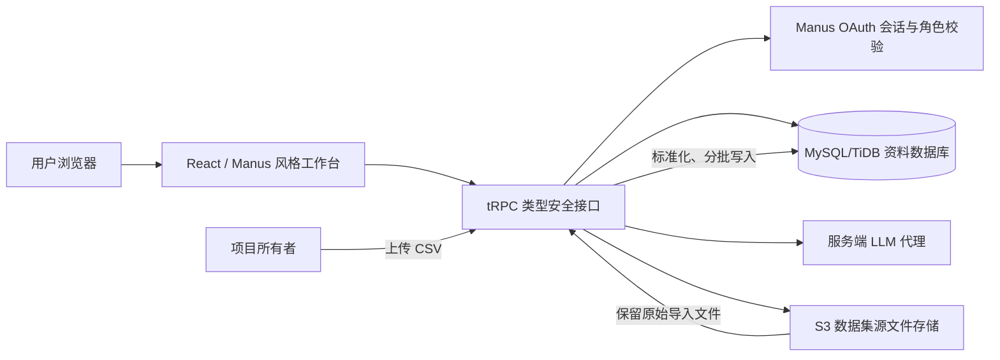
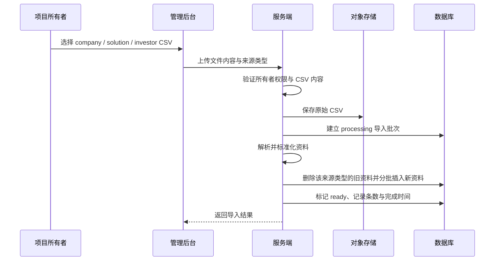
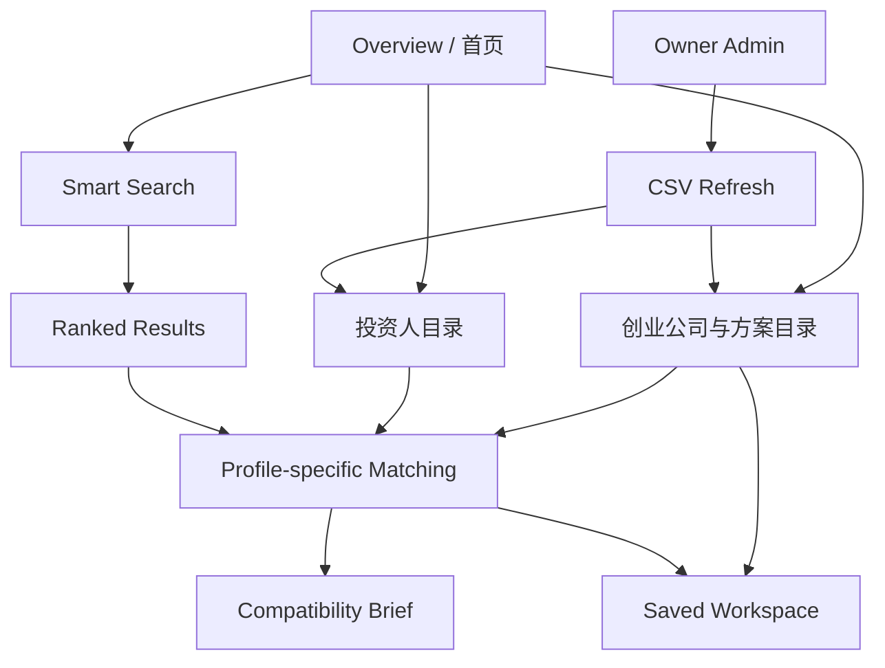

# Matchwise：HKSTP AI 创业公司—投资人匹配平台架构与理念

## 1. 产品定位与核心理念

**Matchwise** 不是一个只依赖关键词的企业目录，而是一个面向 HKSTP 生态的“**可解释的战略引荐工作台**”。它把创业公司、解决方案和投资人的原始 CSV 数据转化为结构化资料，并在用户提出需求或选择某个资料卡时，给出经过排序、有证据、有边界说明的匹配建议。

产品设计遵循三个原则。第一，**数据可追溯**：浏览、筛选、匹配和解释均以已导入的数据集为依据，而非虚构的公司事实、投资案例或用户评价。第二，**AI 可解释**：AI 的职责不是替代投资判断，而是从候选集合中完成语义排序、总结共同点、指出资料缺口，并生成适用于首轮沟通的谈话建议。第三，**工作台优先**：用户应能从“浏览资料”自然地进入“找到匹配对象”，再进入“比较双方”，最终将资料或匹配结果保存起来。

| 用户目标 | Matchwise 的实现方式 | 产出 |
| --- | --- | --- |
| 发现合适的对象 | 目录搜索、类型切换和字段筛选 | 数据集支撑的公司、解决方案或投资人卡片 |
| 用自然语言表达需求 | 智能搜索先选择候选，再由 LLM 排序 | 带评分与原因的最佳匹配清单 |
| 审视一对一匹配 | 侧重双方资料的 AI 对比 | 优势、待验证问题、建议谈话点 |
| 持续跟进 | 登录后的收藏和保存匹配功能 | 个人 watchlist 与已保存摘要 |
| 保持数据新鲜 | 仅项目所有者可访问的 CSV 导入 | 安全存储源文件并原子式替换对应数据集 |

## 2. 系统总体架构

平台采用 **React 前端 + Node/Express 服务端 + tRPC 类型安全接口 + MySQL/TiDB 数据库 + S3 对象存储 + 服务端 LLM** 的全栈架构。浏览器从不直接接触数据库凭据或 LLM 密钥；所有敏感操作都在服务端经过权限校验后执行。

前端负责呈现工作流和交互状态；后端负责数据读写、所有者权限、候选筛选、LLM 调用与结果验证；数据库负责保存结构化资料及用户收藏；对象存储保存管理员上传的原始 CSV，以便形成导入来源记录。

## 3. 数据层：从三份 CSV 到统一的 Profile 模型

原项目提供三类数据源：HKSTP 公司目录、解决方案目录以及投资人目录。它们的字段语言和粒度不同，因此系统不会直接让界面消费原始 CSV 行，而是在导入时转换为统一的 `profiles` 模型。

| 原始来源 | 导入后类型 | 关键映射字段 | 使用场景 |
| --- | --- | --- | --- |
| `hkstp_company_directory.csv` | `company` | 公司名称、cluster、介绍、产品、网站 | 创业公司浏览；作为投资人匹配候选 |
| `2_solutions.csv` | `solution` | 标题、机构、链接、网页内容 | 解决方案浏览；自然语言发现 |
| `3_investor.csv` | `investor` | 投资机构、投资领域、品牌介绍、管理规模、官网 | 投资人浏览；作为公司匹配候选 |

每条统一资料均包含显示字段（名称、行业、描述、技术、投资偏好、票据规模、组合线索、官网等）、原始行 JSON，以及用于搜索与匹配的 `normalizedText`。`normalizedText` 是将最相关字段合并后的文本索引载体，例如公司会合并名称、行业、产品与介绍；投资人会合并名称、投资领域、介绍、规模与组合线索。

这项标准化带来两个价值：前端卡片可以用统一的组件展示不同类型资料；匹配服务也可以使用一致的候选选择逻辑，而不需要为每份 CSV 分别维护一套 AI 提示词和查询规则。

## 4. 数据导入与管理设计

管理员导入流程是一个严格受控的“**替换一个数据类型、保留其他数据类型**”的过程。项目所有者上传 CSV 后，系统先检查会话身份和 `admin` 角色；然后把原始文件写入对象存储，生成导入批次；接着解析 CSV、标准化字段，并以分批写入方式更新数据库。导入成功后，`datasetImports` 表记录文件名、来源类型、条数、状态、操作者与时间；失败则记录错误状态，避免出现“表面上导入成功、实际上资料不完整”的情况。

这种结构使管理员可以更新例如投资人目录，而不会误删公司或解决方案目录。界面同时显示访问拒绝、加载、空状态和失败状态，避免把权限不足或网络错误误导为“没有数据”。

## 5. 匹配引擎：候选召回、LLM 重排、可解释输出

匹配不应该把成千上万条资料一次性交给 LLM。这会导致成本、延迟和上下文噪声都失控。因此 Matchwise 采用两阶段架构。

第一阶段是**确定性候选召回**。系统根据查询或源资料的 `normalizedText` 分词，计算它与相对类型资料的关键词重叠和行业信号，选择最相关的一小批候选。公司与解决方案会寻找投资人；投资人会寻找创业公司。智能搜索则由用户选择目标类型，例如“找创业公司”或“找投资人”。

第二阶段是**LLM 语义重排与解释**。服务端仅将候选资料的必要摘要、来源类型和内部 ID 发送给 LLM，并要求其返回严格 JSON：资料 ID、0–100 的评分和简洁解释。服务端会验证返回的 ID 是否属于给定候选集合、去重、限制评分范围和结果长度。如果模型返回不完整 JSON，则不会让请求崩溃，而是安全降级到基于候选召回的初步排序，并清楚说明其为初步信号。

> AI 在这里是“高质量的分析与排序层”，不是数据库事实来源。它被要求只引用输入资料，并在资料缺失时把缺失说明为待验证问题。

| 匹配入口 | 输入 | 候选集 | LLM 输出 |
| --- | --- | --- | --- |
| 智能搜索 | 用户自然语言 + 目标类型 | 对应类型的高相关资料 | 排名、分数、简洁理由 |
| 公司/方案找投资人 | 选中的公司或方案 | 投资人候选 | 投资契合度与理由 |
| 投资人找公司 | 选中的投资人 | 创业公司候选 | 战略和主题契合度与理由 |
| 双方详细比较 | 一个公司与一个投资人 | 单一资料对 | 总结、优势、资料缺口、谈话点 |

## 6. 一对一兼容性简报

当用户点击“Compare profiles”时，系统将所选公司与投资人资料的结构化摘要交给 LLM。输出被约束为五个部分：整体分数、总体总结、契合信号、待确认的问题以及建议谈话点。

这一设计刻意避免“看起来很聪明但无法行动”的推荐。比如，系统可以指出某公司在 AI 楼宇管理、物联网或节能方面与投资人的 proptech 偏好相符；同时也会指出资料中没有提供融资阶段、收入、客户验证、团队、票据规模或地域偏好。最终谈话点会转化为第一轮会面可使用的问题或材料清单，例如展示试点效果、说明商业模式、确认投资阶段与提出低风险试点方案。

## 7. 权限与用户数据设计

平台将“浏览生态资料”和“管理数据、保存个人工作内容”分开处理。

| 能力 | 未登录访客 | 已登录用户 | 项目所有者 / 管理员 |
| --- | --- | --- | --- |
| 浏览公司、方案、投资人 | 可以 | 可以 | 可以 |
| 使用智能搜索与查看匹配 | 可以 | 可以 | 可以 |
| 收藏 Profile | 需登录 | 可以 | 可以 |
| 保存 Match 简报 | 需登录 | 可以 | 可以 |
| 查看个人 saved workspace | 提示登录 | 可以 | 可以 |
| 上传/替换 CSV | 不可 | 不可 | 可以 |
| 查看导入历史 | 不可 | 不可 | 可以 |

身份由 Manus OAuth 维护，服务端的 `protectedProcedure` 用于保护收藏和保存匹配接口；`ownerProcedure` 进一步检查当前用户是否为项目所有者或管理员。即使有人绕过界面直接调用 API，也不能获得 CSV 导入权限。

## 8. 前端信息架构与视觉系统

前端采用 Manus 风格的持久侧边栏与工作区结构，但没有把所有页面都锁在登录墙后。这样做是为了让目录和 AI 演示能够被探索，同时把个人工作区与管理功能保持为受保护区域。

界面中的深海军蓝被用于 AI 匹配、战略判断和可信赖感；柔和灰蓝背景承担资料密度；创业公司、投资人和智能搜索分别使用不同但克制的辅助色。资料卡强调四类信息：资料身份、结构化标签、可信的原始资料摘要、明确的下一步操作。所有关键页面均提供加载、无结果、权限不足、请求失败和数据暂不可用状态。

## 9. 可靠性与验证

实现中包含数据标准化、候选选择、管理员权限、浏览参数、收藏、保存匹配、智能搜索、资料匹配和详细比较等自动化测试。当前测试套件共有 **11 个测试**，并通过 TypeScript 类型检查。实际浏览器验证覆盖了：公司目录加载、自然语言搜索、AI 排名结果、公司到投资人的匹配、完整的一对一兼容性简报、桌面与移动视图、未登录收藏入口和管理员访问控制界面。

## 10. 后续演进方向

当前架构适合先以高质量 CSV 驱动的生态匹配为核心。下一阶段可添加：资料审核与编辑工作流、行业/阶段等专门字段的更高质量清洗、用户反馈闭环、匹配历史分析、团队协作空间，以及对 CRM 或活动管理系统的安全集成。核心原则应始终保持不变：**以事实数据为基础，让 AI 负责解释和组织，而不是编造；让推荐导向下一次高质量对话，而不是替用户做最终决策。**
